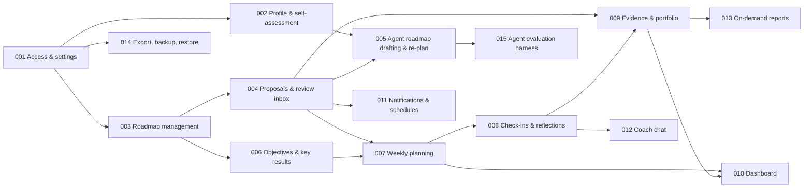

# Feature Breakdown and Specify Prompts

Spec Kit works one feature at a time: `/speckit-specify` creates `specs/NNN-feature-name/spec.md` and records that directory in the machine-local `.specify/feature.json`, which `/speckit-plan` and `/speckit-tasks` then read. `NNN` is assigned sequentially after the highest existing directory, so specify features in the order below, or pin the directory as described in `05-spec-kit-handoff/01-handoff-guide.md`, section 3.2. The core command does not create a git branch; the same section explains the options. This document is the backlog of features in recommended order, each with the requirement IDs it covers, its dependencies, and a paste-ready `specify` prompt written in "what and why" language.

Rule of thumb from Spec Kit: the `specify` prompt describes users and outcomes, not technology. Technology goes into the `plan` prompt (see `05-spec-kit-handoff/01-handoff-guide.md`).

## Delivery order and rationale

Build a **walking skeleton** first (001 → 003 → 004) so the propose-then-apply core exists before any agent intelligence is layered on. Then 002 (profile and self-assessment), which 005 depends on; then the agent (005), objectives (006), the weekly loop (007), check-ins (008), evidence (009), dashboard (010), notifications (011), and coach chat (012). Everything after that is post-v1.

## Feature list

| # | Feature | Priority | Covers | Depends on |
|---|---|---|---|---|
| 001 | Secure access and settings | P0 | FR-001, FR-002, FR-003, FR-004 | – |
| 002 | Profile and self-assessment | P0 | FR-010, FR-011 | 001 |
| 003 | Roadmap and milestone management | P0 | FR-021, FR-023, FR-031 (links) | 001 |
| 004 | Agent proposals and review inbox | P0 | FR-120, FR-121 | 003 |
| 005 | Agent roadmap drafting and re-planning | P0/P1 | FR-020, FR-022, FR-032 | 002, 004 |
| 006 | Current-role objectives and key results | P0 | FR-030, FR-031 | 003 |
| 007 | Weekly planning | P0 | FR-040, FR-041, FR-042 | 004, 006 |
| 008 | Check-ins and reflections | P0/P1 | FR-050, FR-051, FR-052, FR-053 | 007 |
| 009 | Evidence capture and portfolio | P0/P1 | FR-070, FR-071 | 004, 008 |
| 010 | Dashboard and progress insights | P0/P1 | FR-080, FR-081 | 007, 009 |
| 011 | Notifications and schedules | P0/P2 | FR-090, FR-091 | 004 |
| 012 | Coach chat | P1 | FR-060 | 008 |
| 013 | On-demand reports | P2 | FR-100 | 009 |
| 014 | Export, backup, and restore | P0/P1 | FR-110, FR-111, FR-112 | 001 |
| 015 | Agent evaluation harness | P1 (internal) | NFR-012 | 005 |
| 016 | Integration ports for evidence suggestions | P3 | – | 009 |
| 017 | Semantic search over reflections and evidence | P3 | – | 009 |
| 018 | Sharing with a mentor or manager | P3 | – | 001 |

## Specify prompts

Each block below is the natural-language input to `/speckit-specify`. Replace nothing; add detail if you have it. Items marked `[NEEDS CLARIFICATION]` are resolved either by `/speckit-specify` itself (it keeps at most three markers and may ask about them in the same run) or by `/speckit-clarify` (up to five questions per run); the answers are in `05-spec-kit-handoff/02-open-questions.md`.

### 001 Secure access and settings

> Build the foundation that lets a single person use Career OS privately. On first launch, the person creates the one and only account with a strong password. Afterwards they sign in and stay signed in across browser restarts for a configurable period. Repeated failed sign-ins are throttled and logged. Signed in, the person manages settings: timezone, week start day, preferred check-in times, which model the assistant uses and how much effort it spends per kind of task, a monthly spending budget for the assistant, and how autonomous the assistant may be (proposals only by default). A usage page shows assistant spend for the current month against the budget, with warnings at 80 percent and a pause of background assistant work at 100 percent. Health of the system (database reachable, worker alive, last backup time) is visible on the same page. Why: everything else depends on a trusted private space and a known cost ceiling.

### 002 Profile and self-assessment

> Let the person describe their situation and rate themselves against a built-in competency model for Software Architects. The profile captures current role, target role, target date, weekly hours available for growth work, working context (company type, team size, technology domain), strengths, and growth areas. The competency model is browsable: domains, competencies within each, and four levels per competency with observable behaviours and example evidence. For each competency the person can set their current level with a confidence rating and a note; assessments are dated and the history is kept, so re-assessing later shows movement. A summary view shows the gap between current and target levels per domain. Why: the roadmap must start from an honest, explicit picture of where the person is.

### 003 Roadmap and milestone management

> Provide the person with a roadmap toward the target role that they fully control. A roadmap has tracks; v1 has a growth track (competency-driven) and a results track (current-role outcomes). Each track holds milestones with a title, description, definition of done, target date, priority, status, an optional linked competency, an optional linked objective, and a flag saying whether evidence is required to close it. Milestones contain activities (learn, practice, deliver, share, connect) with estimated hours, due date, status, and an optional resource link. The person can create, edit, reorder, and change the status of milestones and activities. Status changes record who made them and when. Closing a milestone that requires evidence but has none linked warns the person and leaves a visible gap. Roadmap versions are recorded whenever a re-plan is applied, and older versions remain readable. Views: timeline by track and a board by status. Why: the roadmap is the backbone every other feature attaches to, and the person must trust that they, not the assistant, own it.

### 004 Agent proposals and review inbox

> Introduce the mechanism by which the assistant changes anything: proposals. A proposal is a bundle of operations (for example "create milestone", "move target date", "set weekly plan", "capture evidence") with a rationale and references for each operation. Proposals appear in an inbox with a badge count. The person reviews each operation and approves, edits before approving, or rejects it with an optional reason. Approved operations are applied together; partial approval is allowed; rejected operations are kept for the record. Proposals expire after a configurable period if untouched. Every proposal shows which assistant session produced it and links to that session's transcript. A setting allows low-risk operations (for example marking a plan item done after the person said so in a check-in) to be auto-applied; it is off by default. Why: the person wants the assistant to draft and adjust plans, but to keep the final say, with an auditable trail. [NEEDS CLARIFICATION: default expiry period for untouched proposals.]

### 005 Agent roadmap drafting and re-planning

> Let the assistant draft a roadmap and later propose re-plans. Drafting: using the profile, self-assessment, and competency model, the assistant proposes tracks, milestones spanning the next two to four quarters with target dates, definitions of done, evidence requirements, starter activities, and a rationale per milestone that cites the competency gap or objective it addresses. The draft respects the person's weekly hours and target date, favours milestones that serve both growth and current-role results, and states what it deliberately left out. Re-planning: every night the system looks for milestones past their target date or at risk, and if no re-plan proposal is pending, the assistant proposes options (move, split, deprioritise, add activity) with rationale. The person can also ask for a re-plan at any time, or ask for suggested links between objectives and milestones. All output arrives as proposals. Why: a strong first draft and timely re-plans are the assistant's main value; the person curates rather than authors.

### 006 Current-role objectives and key results

> Track results in the current role as quarterly objectives with key results. An objective has a quarter, title, outcome statement, status, and an optional result area from a built-in results framework (delivery, quality and reliability, team growth, technical excellence, stakeholder outcomes). A key result has a metric, unit, baseline, target, and a current value updated over time with dated notes. Objectives link to roadmap milestones; the UI shows growth milestones without a delivery anchor and objectives without growth leverage, and highlights dual-purpose work. At quarter end the person closes or rolls each objective with a short retrospective note. Why: the person's promotion case depends on proven results, and growth work is more sustainable when it is also delivery work.

### 007 Weekly planning

> Run the weekly loop. On a scheduled day and time, the assistant proposes next week's plan: items drawn from open activities, milestones, and key results, each with planned hours, a focus theme for the week, and a note on what was excluded and why. The total must fit the person's capacity for that week (default from the profile, adjustable per week). The person edits and approves; the week becomes active. During the week a board shows items by status; marking an item done updates the linked activity or key result. At week end the person closes the week: every unfinished item is explicitly carried over, rescheduled, or dropped, and a short close-out note is stored. The next proposal uses the carry-overs. Why: weekly commitment within real capacity is where the roadmap meets reality.

### 008 Check-ins and reflections

> Provide assistant-led check-ins with templates. Daily (five minutes): what moved, what is blocked, the one thing for tomorrow; at most three questions, referencing today's plan items by name. Weekly review: walk each plan item, decide done, carried over, or dropped, surface lessons, and propose evidence capture for items that required evidence. Monthly retrospective: milestones on track or slipping, competency domains with no activity this month, objectives trending, sustainability. Quarterly review: objectives and key results against baselines, re-assessment prompts for competencies with new evidence. Ad hoc: a free-form reflection session. Check-ins are conversations streamed in real time; the assistant may record reflections and create proposals, but never applies changes. Each check-in ends with a stored summary. The person can also write a reflection at any time and tag it with milestones or objectives. An interrupted check-in can be resumed within 24 hours. Reminders fire at configured times. Why: reflection is the habit that keeps the system honest, and it must be short enough to survive a busy week. [NEEDS CLARIFICATION: default check-in times and whether weekends are included for daily check-ins.]

### 009 Evidence capture and portfolio

> Let the person capture evidence of results and capabilities while fresh, and read it back later. An evidence item has a title, kind (document, pull request, design review, decision record, metric, feedback, presentation, other), date, optional link, optional attachment stored locally within a size limit, and an impact statement structured as situation, task, action, result. Evidence links to milestones, objectives, and competencies; the form suggests links from the current week's items. During weekly reviews the assistant proposes pre-filled evidence items for completed work that required evidence; the person completes and approves them. The portfolio view filters by quarter, competency, objective, kind, and shows gaps: closed milestones that required evidence and have none. Why: the promotion case is built from evidence, and evidence is cheapest to capture the week it happens. [NEEDS CLARIFICATION: attachment size limit and total storage expectation.]

### 010 Dashboard and progress insights

> Give the person one screen that answers "where am I and what is next": the current week's items and hours, pending proposals, the next scheduled check-in, roadmap progress per track (milestones done, in progress, slipping), objectives and key result trends for the quarter, evidence gaps, and a countdown to the target date. A second view shows competency coverage over time: which domains received activity and evidence each month, which have been neglected. Why: a single glance should be enough to decide what to do today.

### 011 Notifications and schedules

> Deliver in-app notifications for new proposals, check-in reminders, budget warnings, job failures, and backup problems, with read and unread state and deep links. Let the person configure schedules: weekly plan proposal time, daily and weekly check-in reminders, monthly and quarterly reminders, nightly re-plan check. Later, allow optional delivery through the person's own email server or a self-hosted push service. Why: the assistant's work is only useful if the person notices it at the right moment.

### 012 Coach chat

> Offer an ad hoc conversation with the assistant that knows the person's roadmap, plans, objectives, reflections, and evidence. Typical questions: how to prepare for an upcoming architecture review given the roadmap; which milestone to drop if capacity shrinks; how to phrase an impact statement. Conversations are threads that can be continued later. If a conversation leads to a plan change, the assistant creates a proposal; it never changes state directly. Why: advice grounded in the person's own data is more useful than generic coaching.

### 013 On-demand reports (post-v1)

> When the person asks, compose a document from approved evidence, closed milestones, and objective outcomes for a chosen period: a weekly summary, a quarterly review narrative, or a promotion-case draft organised by competency domain. The person edits and exports the result. Reports are never generated unasked. Why: writing the review should be editing a strong draft, not starting from nothing.

### 014 Export, backup, and restore

> Protect two years of career data. Daily automated backups of the database and attachments with 30-day retention and optional encrypted off-host copies; a documented, tested restore procedure. Full export of all data in open formats (JSON and original files) and import into a fresh installation. The person can view, edit, and delete the notes the assistant keeps about them. Why: data loss or lock-in would defeat the purpose of a personal system.

### 015 Agent evaluation harness (internal)

> Give developers a repeatable way to judge assistant quality: a suite of scenarios (profiles, roadmaps, check-in transcripts) with expected properties (for example: a roadmap draft covers every domain with a gap, respects capacity, and cites rationale; a daily check-in asks at most three questions and proposes only items the person mentioned). Scenarios run against the real model on a schedule and against recorded fixtures in unit tests. Results are tracked over time and a pass threshold gates releases. Why: prompt and model changes must not silently degrade the assistant.

### 016 to 018 (recorded ideas, no prompt yet)

- **016 Integration ports:** read-only adapters (GitHub, Jira or Linear, calendar) that suggest evidence items for the person to confirm. Deliberately excluded from v1 by the user's decision.
- **017 Semantic search:** find reflections and evidence by meaning, not keywords.
- **018 Sharing:** read or comment access for a mentor or manager on selected views, for example the portfolio.
