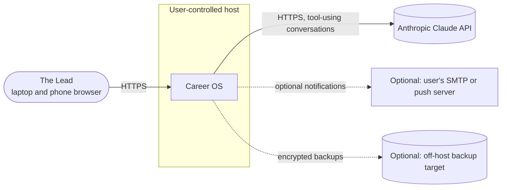
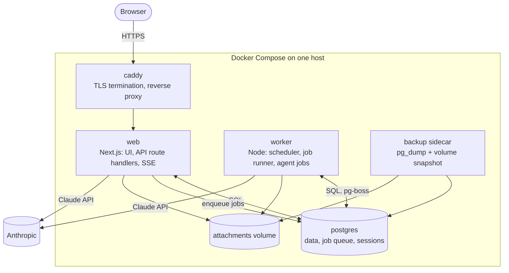
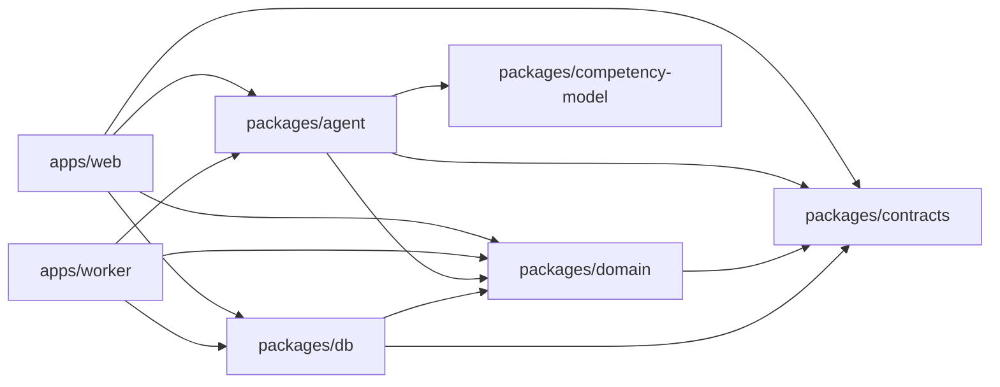
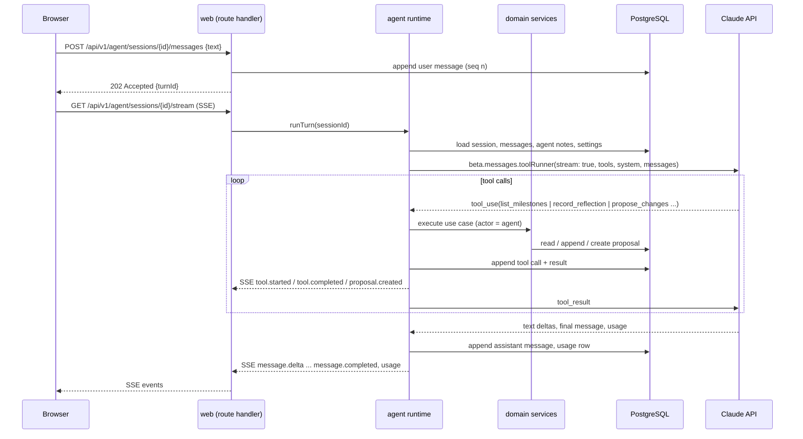
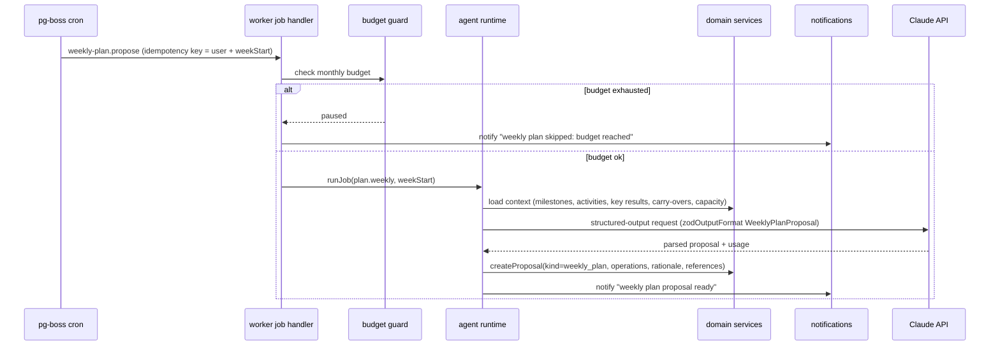
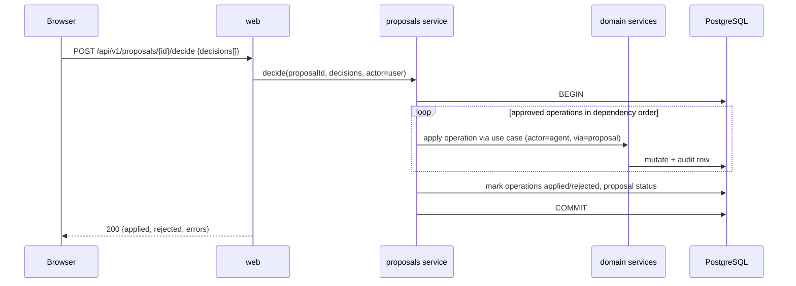

# System Architecture

This document is the primary technical context for `/speckit-plan`. It describes the system as it should be built for v1: a TypeScript modular monolith with a web application, a background worker, and PostgreSQL, running in Docker on infrastructure the user controls. Decisions are justified in `04-decisions/`.

## Architectural drivers

| Driver | Source | Architectural response |
|---|---|---|
| Single user, personal data | Vision, NFR-001 | Self-hosted; one database; minimal exposure; no third-party services beyond the LLM API |
| One part-time developer | Constraints | Modular monolith; one language; generated contracts; few runtime components (constitution IV) |
| Agent proposes, user decides | Decision log, FR-120 | Proposal subsystem as the only agent write path; domain services enforce actor rules |
| Scheduled agent work without the user present | FR-022, FR-040, FR-050 | Separate worker process with a durable, Postgres-backed job queue |
| Streaming conversations | NFR-003 | Server-Sent Events from the web app; agent runtime streams tokens |
| Bounded cost | FR-003, FR-004, NFR-005 | Usage recorded per request; budget guard in the worker and API |
| Explainability | Constitution III | Append-only session, message, tool-call, and usage tables; proposals carry references |
| Recoverability | NFR-006, constitution IX | Compose-first deployment; backup sidecar; export/import |

## Context



Only the Claude API is a required external dependency. Everything else is optional and user-owned.

## Containers (deployable units)



| Container | Responsibility | Scaling note |
|---|---|---|
| `web` | Serves the UI, the versioned JSON API, SSE streams for interactive agent sessions, file upload and download, health endpoints. Runs interactive agent sessions (check-ins, coach chat) in-process because they need a live stream to the browser. | One replica. Interactive sessions are short-lived; a restart ends the stream and the session resumes from stored messages. |
| `worker` | Runs scheduled and long-running jobs: weekly plan drafting, roadmap drafting, nightly re-plan detection, reminders, usage roll-ups, budget checks, backup verification. Uses pg-boss for cron and queueing. | One replica. pg-boss guarantees single execution per job with retries. |
| `postgres` | System of record, job queue schema, auth sessions. | Single instance, volume-backed. |
| `caddy` | TLS (automatic certificates when a domain is used, or self-signed/Tailscale certs), HTTP to HTTPS redirect, basic request limits. | Optional on a private network with its own TLS. |
| `backup` | Nightly `pg_dump` and attachment archive to a local volume, optional rclone to an off-host target with encryption. | Can be replaced by host-level backups. |

## Components inside the monorepo

```
career-os/
  apps/
    web/                 Next.js (App Router): UI, route handlers under /api/v1, SSE, auth middleware
    worker/              Node entrypoint: pg-boss scheduler and job handlers
  packages/
    contracts/           Zod schemas: API DTOs, SSE events, proposal operations, tool I/O, settings
    domain/              Entities, state machines, use cases (services); no framework imports
    db/                  Drizzle schema, migrations, repositories, seed for the competency model
    agent/               Agent runtime: prompts, tools, job definitions, runner, usage accounting
    competency-model/    The versioned competency model and results framework as data
    ui/                  Shared React components (design system wrappers), theme
    config/              Typed environment loading, shared eslint/tsconfig
  docs/                  These documents
  specs/                 Spec Kit features (created by Spec Kit)
  infra/
    compose/             docker-compose.yml, Caddyfile, backup scripts
    k8s/                 Later: Helm chart
```

Dependency direction is strict and enforced by lint rules:



`domain` never imports `db`, `agent`, or Next.js. Repositories in `db` implement interfaces declared in `domain`. The agent package depends on `domain` use cases, so tools call the same services the UI calls, with `actor = agent`.

### Domain modules (bounded contexts inside the monolith)

| Module | Owns | Key use cases |
|---|---|---|
| `identity` | user, credentials, sessions, settings | signIn, rotateSession, updateSettings, getUsageSummary |
| `profile` | profile, self-assessments | upsertProfile, recordSelfAssessment, gapSummary |
| `competency` | competency model versions (read-only at runtime) | getModel, getDomain, levelDescriptors |
| `roadmap` | roadmap, tracks, milestones, activities, roadmap versions | createMilestone, changeStatus, reorder, snapshotVersion, detectSlips |
| `objectives` | objectives, key results, links | createObjective, updateKeyResult, linkMilestone, unlinkedReport |
| `planning` | weekly plans, plan items, capacity | openWeek, updateItemStatus, closeWeek, carryOver |
| `reflection` | check-ins, reflections, templates | startCheckIn, appendReflection, completeCheckIn, resume |
| `evidence` | evidence, links, attachments | captureEvidence, linkEvidence, gapReport, storeAttachment |
| `proposals` | proposals, operations, decisions, application | createProposal, decide, applyApproved, expire |
| `agent` (runtime) | agent sessions, messages, tool calls, usage, notes, budget | runInteractiveTurn, runJob, recordUsage, checkBudget |
| `notifications` | notifications, schedules | notify, markRead, upsertSchedule |
| `backup` | backup runs, export, import | exportAll, importAll, recordBackupRun |

## Key runtime flows

### Interactive check-in turn (web process)



Properties: the user message is durably stored before the model is called; a web restart mid-turn leaves the session resumable from the last stored message; the browser can reconnect to the stream with `Last-Event-ID`.

### Scheduled weekly plan proposal (worker process)



Properties: the job is idempotent per week; retries after a crash do not create duplicate proposals because the proposal creation checks for an existing pending proposal of the same kind and week.

### Proposal decision and application (web process)



Properties: all-or-nothing within the approved subset; if one operation fails validation the whole decision rolls back and the UI shows which operation and why.

## Technology stack (v1)

| Layer | Choice | Notes |
|---|---|---|
| Language and runtime | TypeScript (strict), current Node.js LTS | Single language everywhere (ADR-0001) |
| Monorepo | pnpm workspaces + Turborepo | Task caching for lint, test, build |
| Web framework | Next.js (App Router), React | UI and API in one deployable; Server Components for read views, client components for boards and chat (ADR-0002) |
| UI | Tailwind CSS, shadcn/ui components, TanStack Query, React Hook Form + Zod | Phone-first layouts for check-ins and boards |
| API style | JSON over HTTP under `/api/v1`, Zod-validated, OpenAPI generated from Zod; SSE for streams | Explicit contracts for Spec Kit's `contracts/` (ADR-0002) |
| Database | PostgreSQL 17 | Single datastore, including job queue (ADR-0003) |
| ORM and migrations | Drizzle ORM + drizzle-kit SQL migrations | Typed schema close to SQL (ADR-0009) |
| Job queue and scheduling | pg-boss | Cron, retries, singleton jobs, no Redis (ADR-0003) |
| Agent runtime | `@anthropic-ai/sdk` tool runner with Zod tools, structured outputs, prompt caching, streaming | Harness choice in ADR-0004; model policy in ADR-0006 |
| Auth | Password (Argon2id) + optional TOTP; signed HttpOnly session cookies stored in Postgres | Single user (ADR-0007) |
| File storage | Local volume, content-addressed paths, served through an authenticated route | Attachments stay on host |
| Logging | pino JSON logs with request and session correlation IDs | Shipped nowhere by default; optional Loki/Grafana profile |
| Metrics and tracing | OpenTelemetry SDK with OTLP exporter, disabled by default | Enable with a Compose profile |
| Testing | Vitest, Testcontainers (Postgres), Playwright, agent eval harness | See `08-quality-and-testing.md` |
| CI | GitHub Actions | Lint, typecheck, test, build and push images to GHCR |
| Deployment | Docker Compose; Helm chart later | ADR-0010 |

## Cross-cutting concerns

- **Actor model.** Every use case receives `{ actor: "user" | "agent" | "system", sessionId?, proposalId? }`. Mutations by `agent` are accepted only through proposal application, except for append-only writes (reflections, agent notes). The audit log records the actor on every mutation.
- **Idempotency.** Jobs carry idempotency keys; proposal creation de-duplicates by kind and scope; API mutations accept an `Idempotency-Key` header for retries from the mobile browser.
- **Time.** All timestamps stored in UTC; the user's timezone from settings drives schedules and display. Week boundaries are computed from the configured week start.
- **Validation.** Zod at the edge (route handlers, tool inputs, job payloads); domain invariants in services; database constraints as the last line.
- **Errors.** API errors use the problem details format (`application/problem+json`) with stable `type` URIs; agent failures are recorded on the session with a user-readable reason.
- **Configuration.** Typed environment loading in `packages/config`; runtime-changeable settings live in the `settings` table and are cached in process with invalidation on write.
- **Feature flags.** A small `features` map in settings for toggles such as auto-apply, email notifications, OpenTelemetry.

## Capacity and performance assumptions

The system serves one user. Data volume after two years is small: on the order of a few thousand plan items, a few hundred check-ins with transcripts, and a few hundred evidence items. Plain PostgreSQL indexes are sufficient; no caching tier is justified. The only latency-sensitive path is agent streaming, which is dominated by model time; prompt caching (see `02-agent-architecture.md`) keeps time-to-first-token low.

## Evolution paths (not built in v1)

| Future need | Path |
|---|---|
| Multi-user or mentor sharing | `user_id` already on every table; add roles and row-level filters; introduce invitations |
| Integrations for evidence suggestions | `evidence` module exposes an `EvidenceSuggestionPort`; adapters run in the worker and create proposals |
| Semantic search | Enable pgvector in the same PostgreSQL; embed reflections and evidence in a worker job |
| Kubernetes | One Deployment per container, a CloudNativePG cluster or managed Postgres, Ingress for TLS; Helm chart in `infra/k8s` |
| Higher availability | Not a goal; if needed, Postgres replication and two web replicas with sticky SSE |
