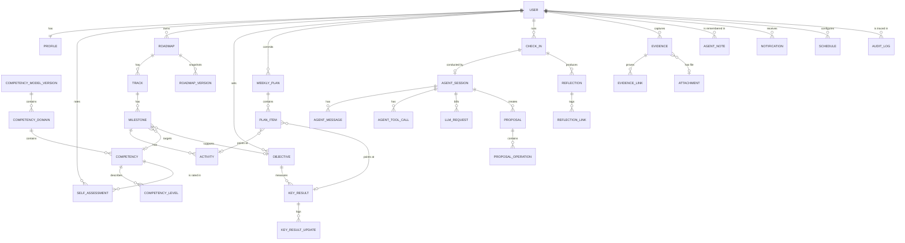
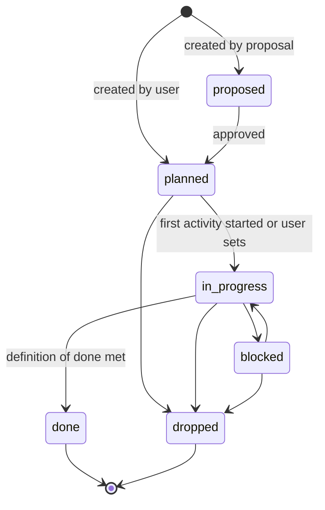
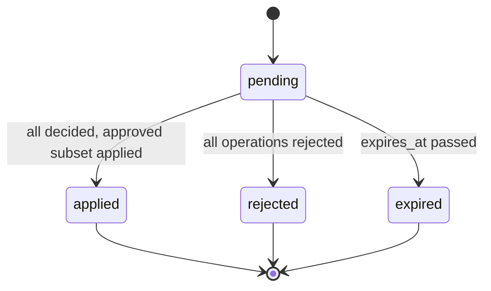

# Data Model

Logical data model for Career OS, the source for Spec Kit's `data-model.md` in each feature. PostgreSQL is the only datastore (ADR-0003). Names follow the glossary. Every table carries `id` (UUIDv7), `user_id`, `created_at`, `updated_at` unless stated otherwise; `user_id` exists for a future multi-user release and is always the single user in v1.

## Entity overview

## Tables by module

### identity

| Table | Columns (beyond common) | Notes |
|---|---|---|
| `users` | `email`, `display_name`, `timezone`, `week_start_day` (0–6) | Exactly one row in v1; enforced by application logic, not schema |
| `auth_credentials` | `user_id`, `password_hash` (Argon2id), `totp_secret_enc` nullable, `failed_attempts`, `locked_until` | One per user |
| `auth_sessions` | `id` (opaque token hash), `user_id`, `expires_at`, `last_seen_at`, `user_agent`, `ip` | Cookie holds the token; row stores its hash |
| `settings` | `user_id`, `key`, `value` jsonb | Keys: `model`, `effort.<jobType>`, `monthly_budget_usd`, `autonomy_level`, `checkin_times`, `features`, `price_table`, `proposal_expiry_days`, `attachment_max_mb` |

### profile and competency

| Table | Columns | Notes |
|---|---|---|
| `profiles` | `user_id`, `current_role`, `target_role`, `target_date`, `weekly_growth_hours` numeric, `context` jsonb (company_type, team_size, domain), `strengths` text[], `growth_areas` text[], `notes` | One per user |
| `competency_model_versions` | `version` (semver), `published_at`, `source` | Seeded from `packages/competency-model`; append-only |
| `competency_domains` | `model_version_id`, `key`, `name`, `description`, `order` | |
| `competencies` | `domain_id`, `key`, `name`, `description`, `order` | `key` stable across versions for history |
| `competency_levels` | `competency_id`, `level` (1–4), `name`, `behaviours` text[], `example_evidence` text[] | |
| `self_assessments` | `user_id`, `competency_key`, `model_version_id`, `level` (1–4), `confidence` (1–3), `note`, `assessed_at` | Append-only; latest per key is the current assessment |

### roadmap

| Table | Columns | Notes |
|---|---|---|
| `roadmaps` | `user_id`, `title`, `status` (`draft`,`active`,`archived`), `current_version` int | One active per user (partial unique index) |
| `roadmap_versions` | `roadmap_id`, `version`, `snapshot` jsonb, `reason`, `proposal_id` nullable, `created_by` actor | Written on every applied re-plan and on activation |
| `tracks` | `roadmap_id`, `kind` (`architect_growth`,`role_results`), `name`, `order` | |
| `milestones` | `track_id`, `title`, `description`, `definition_of_done`, `target_date`, `priority` (`must`,`should`,`could`), `status`, `competency_key` nullable, `objective_id` nullable, `evidence_required` bool, `order`, `closed_at` | Status enum below |
| `milestone_status_history` | `milestone_id`, `from_status`, `to_status`, `actor`, `via_proposal_id` nullable, `reason`, `changed_at` | |
| `activities` | `milestone_id`, `kind` (`learn`,`practice`,`deliver`,`share`,`connect`), `title`, `description`, `estimated_hours` numeric, `due_date` nullable, `status`, `resource_url` nullable, `order` | |

Milestone status machine:

Activity statuses: `todo`, `doing`, `done`, `dropped`.

### objectives

| Table | Columns | Notes |
|---|---|---|
| `objectives` | `user_id`, `quarter` (e.g. `2026-Q4`), `title`, `outcome_statement`, `result_area` nullable (from results framework), `status` (`active`,`achieved`,`partially_achieved`,`missed`,`rolled`), `retro_note`, `closed_at` | |
| `key_results` | `objective_id`, `metric`, `unit`, `baseline` numeric, `target` numeric, `current` numeric, `direction` (`increase`,`decrease`), `order` | |
| `key_result_updates` | `key_result_id`, `value`, `note`, `actor`, `via_proposal_id` nullable, `recorded_at` | Append-only |

Milestone ↔ objective is a nullable foreign key on `milestones` (one objective per milestone keeps the model simple). Objective ↔ competency insight is derived through milestones.

### planning

| Table | Columns | Notes |
|---|---|---|
| `weekly_plans` | `user_id`, `week_start` date, `status` (`proposed`,`active`,`closed`), `capacity_hours`, `focus_theme`, `excluded_note`, `closeout_note`, `proposal_id` nullable, `activated_at`, `closed_at` | Unique on (`user_id`,`week_start`) |
| `plan_items` | `weekly_plan_id`, `source_type` (`activity`,`milestone`,`key_result`,`adhoc`), `source_id` nullable, `title`, `planned_hours`, `actual_hours` nullable, `status` (`todo`,`doing`,`done`,`carried_over`,`dropped`,`rescheduled`), `outcome_note`, `carried_from_item_id` nullable, `order` | Sum of `planned_hours` ≤ `capacity_hours` enforced in the service |

Weekly plan lifecycle: `proposed` (from agent) → `active` (user approved or created manually) → `closed` (all items decided). Closing requires every item in a terminal status.

### reflection

| Table | Columns | Notes |
|---|---|---|
| `check_ins` | `user_id`, `type` (`daily`,`weekly_review`,`monthly_retro`,`quarterly_review`,`adhoc`), `scheduled_for`, `started_at`, `completed_at`, `status` (`scheduled`,`in_progress`,`completed`,`abandoned`), `agent_session_id` nullable, `summary` jsonb (wins, blockers, next_focus, decisions, open_questions), `weekly_plan_id` nullable | Resume allowed while `in_progress` and `started_at` within 24h |
| `reflections` | `user_id`, `check_in_id` nullable, `body`, `tags` text[], `source` (`user`,`agent_recorded`), `recorded_at` | Append-only; `agent_recorded` bodies quote the user |
| `reflection_links` | `reflection_id`, `target_type` (`milestone`,`objective`,`competency`), `target_id` or `target_key` | |

### evidence

| Table | Columns | Notes |
|---|---|---|
| `evidence` | `user_id`, `title`, `kind` (`document`,`pull_request`,`design_review`,`decision_record`,`metric`,`feedback`,`presentation`,`other`), `occurred_on`, `url` nullable, `attachment_id` nullable, `impact` jsonb (situation, task, action, result), `status` (`draft`,`final`), `created_via_proposal_id` nullable | `draft` is used for agent-proposed items awaiting completion |
| `evidence_links` | `evidence_id`, `target_type` (`milestone`,`objective`,`competency`), `target_id` or `target_key` | |
| `attachments` | `user_id`, `sha256`, `original_name`, `mime_type`, `size_bytes`, `storage_path`, `uploaded_at` | Files on the attachments volume under `sha256[0:2]/sha256` |

### proposals

| Table | Columns | Notes |
|---|---|---|
| `proposals` | `user_id`, `agent_session_id`, `kind` (`roadmap_draft`,`replan`,`weekly_plan`,`updates`,`evidence`), `scope_key` (e.g. `week:2026-10-12`), `title`, `summary`, `status`, `expires_at`, `decided_at`, `applied_at` | Partial unique index on (`user_id`,`kind`,`scope_key`) where `status='pending'` prevents duplicates |
| `proposal_operations` | `proposal_id`, `seq`, `op_type`, `payload` jsonb (validated against the `Operation` union), `rationale`, `references` jsonb, `risk` (`low`,`normal`), `decision` (`pending`,`approved`,`edited`,`rejected`), `edited_payload` jsonb nullable, `reject_reason`, `applied_at`, `error` | Applied in `seq` order |

Proposal status machine:

`applied` with some rejected operations is still `applied`; the per-operation `decision` keeps the detail.

### agent

| Table | Columns | Notes |
|---|---|---|
| `agent_sessions` | `user_id`, `job_type`, `mode` (`interactive`,`background`), `trigger` (`user`,`schedule`,`system`), `status` (`running`,`completed`,`failed`,`cancelled`), `model`, `effort`, `template` nullable, `idempotency_key` nullable, `started_at`, `ended_at`, `failure_reason`, `total_input_tokens`, `total_cache_read_tokens`, `total_cache_creation_tokens`, `total_output_tokens`, `total_cost_usd` | Totals maintained from `llm_requests` |
| `agent_messages` | `session_id`, `seq`, `role` (`user`,`assistant`,`system`), `content` jsonb (full content block array), `created_at` | Append-only; never updated or deleted |
| `agent_tool_calls` | `session_id`, `message_seq`, `tool_use_id`, `tool_name`, `input` jsonb, `result_summary`, `is_error`, `duration_ms`, `created_at` | |
| `llm_requests` | `session_id`, `seq`, `model`, `effort`, `input_tokens`, `cache_creation_input_tokens`, `cache_read_input_tokens`, `output_tokens`, `stop_reason`, `latency_ms`, `cost_usd`, `created_at` | Cost from the price table at request time |
| `agent_notes` | `user_id`, `category` (`preference`,`constraint`,`context`,`style`), `body`, `source_session_id`, `active` bool | User can edit or deactivate |
| `usage_daily` | `user_id`, `day`, `job_type`, `requests`, `input_tokens`, `cache_read_tokens`, `output_tokens`, `cost_usd` | Materialised by the daily roll-up job |

### notifications and schedules

| Table | Columns | Notes |
|---|---|---|
| `notifications` | `user_id`, `kind`, `title`, `body`, `link`, `severity` (`info`,`warning`,`error`), `read_at`, `created_at` | |
| `schedules` | `user_id`, `job_type`, `cron`, `timezone`, `enabled`, `last_fired_at` | Mirrored into pg-boss on change |

### audit and backup

| Table | Columns | Notes |
|---|---|---|
| `audit_log` | `user_id`, `actor`, `agent_session_id` nullable, `proposal_id` nullable, `entity_type`, `entity_id`, `action`, `before` jsonb, `after` jsonb, `at` | Written by domain services on every mutation |
| `backup_runs` | `started_at`, `finished_at`, `status`, `size_bytes`, `location`, `error` | Written by the backup sidecar through a small API call or a shared table |

pg-boss manages its own tables in the `pgboss` schema.

## Integrity rules enforced in services (not only schema)

1. Agent-originated mutations to roadmap, objectives, planning, and evidence must carry `via_proposal_id` (constitution II).
2. A milestone with `evidence_required = true` moving to `done` without an `evidence_links` row records a `gap` flag used by the dashboard; the move is allowed with a warning.
3. Weekly plan `planned_hours` sum must not exceed `capacity_hours`; proposals violating this are rejected at creation with a correctable error for the agent.
4. Only one `pending` proposal per (`kind`, `scope_key`).
5. `self_assessments`, `reflections`, `agent_messages`, `llm_requests`, `key_result_updates`, `milestone_status_history`, `audit_log` are append-only; no update or delete routes exist for them except user deletion of `agent_notes` and GDPR-style full export/delete.

## Indexing notes

- `milestones (user_id, status, target_date)` for slip detection and dashboard.
- `plan_items (weekly_plan_id, status)`; `weekly_plans (user_id, week_start)` unique.
- `proposals (user_id, status, created_at)`; partial unique index described above.
- `agent_messages (session_id, seq)` unique; `llm_requests (session_id, seq)` unique.
- `evidence (user_id, occurred_on)`; `evidence_links (target_type, target_id)`.
- `reflections` gets a `tsvector` generated column for keyword search; pgvector is a later addition.

## Retention and deletion

Nothing is deleted automatically. The user can delete evidence, attachments, agent notes, and coach threads. Check-in transcripts can be deleted by the user; the check-in summary and reflections remain unless deleted explicitly. Full account deletion is a scripted operation that drops all rows for the user and the attachment files.
