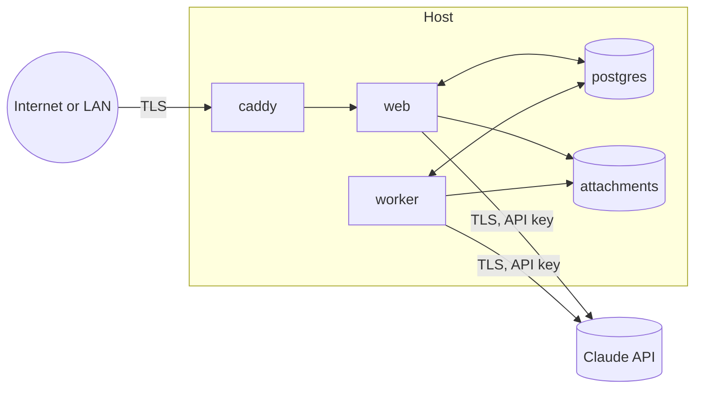

# Security and Privacy

Career OS holds career-sensitive personal data for one person on infrastructure they control. The threat model is modest but real: the host may be reachable from a home network or the internet, the LLM provider receives planning text, and the agent executes tool calls derived from model output.

## Assets

| Asset | Sensitivity | Where |
|---|---|---|
| Profile, self-assessment, reflections, check-in transcripts | High (personal, career-affecting) | PostgreSQL |
| Evidence and attachments (may reference employer work) | High | PostgreSQL + attachments volume |
| Roadmap, plans, objectives | Medium | PostgreSQL |
| Credentials: password hash, TOTP secret, session tokens | Critical | PostgreSQL |
| LLM API key | Critical | Environment or Docker secret |
| Backups | High | Backup volume, optional off-host target |

## Trust boundaries

Boundaries: (1) browser ↔ edge, (2) edge ↔ app, (3) app ↔ database and volume (same host, private network), (4) app ↔ LLM provider.

## Threats and controls

| Threat | Control |
|---|---|
| Unauthorised access from the network | Single account; Argon2id password hashing; optional TOTP; login throttling (5 failures → delay, exponential), lockout after 20; sessions in HttpOnly, Secure, SameSite=Lax cookies with 30-day idle expiry and rotation on privilege change; prefer exposure via a private overlay network (Tailscale or WireGuard) rather than the public internet (ADR-0007) |
| Cross-site request forgery | SameSite cookies plus `Origin` check on all state-changing requests; no CORS allowances |
| Cross-site scripting | React escaping; markdown from the agent rendered through a sanitiser with an allowlist; strict Content Security Policy (no inline scripts, `connect-src 'self'`) |
| Attachment abuse | Size limit per file and total quota; MIME sniffing; files served with `Content-Disposition: attachment` and `X-Content-Type-Options: nosniff`; stored outside the web root under content hashes |
| SQL injection | Drizzle parameterised queries only; no string-built SQL |
| Secrets leakage | Secrets never in the repo or images; `.env` excluded; Docker secrets supported; logs redact `ANTHROPIC_API_KEY`, cookies, and password fields |
| Prompt injection through stored data | Single user authors all stored text, so risk is low; still, tool results are passed as data, tool inputs are schema-validated, and the agent has no tools that reach outside the database |
| Agent over-reach | All plan-state mutations via proposals (constitution II); iteration and token caps; actor checks in domain services |
| Model refusals or unexpected output | Refusal fallbacks enabled; refused turns run no tools; failures surfaced to the user |
| Data loss | Daily backups, 30-day retention, tested restore (constitution IX) |
| Backup theft | Off-host copies encrypted (age or rclone crypt) with a key stored outside the host |
| Dependency vulnerabilities | Dependabot or Renovate; `pnpm audit` in CI; pinned base images; monthly rebuild |
| Host compromise | Out of scope for the application; mitigations are host hardening and the overlay network |

## Privacy and the LLM provider

- Only the content a job needs is sent: context packs are built from explicit selectors, not "dump everything". Attachments are never sent to the model in v1.
- The UI shows a one-time notice recommending that employer-confidential details be paraphrased in reflections and evidence.
- Every request is recorded with token counts so the user can see exactly how much and how often data left the host. The session record shows what tools returned, which is what the model saw.
- Provider data-retention terms apply as configured on the user's Anthropic account; the application does not add any third-party processors.

## Authentication details

- Setup route creates the account only when none exists; afterwards it returns 409.
- Password policy: minimum 12 characters, checked against a breached-password list offline (optional, local list).
- TOTP optional; recovery codes shown once and stored hashed.
- Session token: 256-bit random, stored as SHA-256 hash; cookie `cos_session`; sliding expiry; explicit logout deletes the row.
- Rate limiting at Caddy for `/api/v1/auth/*` as a second layer.

## Authorisation

Single user means no roles in v1; every query is still scoped by `user_id` from the session so the future sharing feature is a filter change, not a rewrite.

## Logging and audit

- Logs exclude message bodies by default (log level `info`); `debug` level can include truncated bodies for local troubleshooting and is never enabled in the default Compose file.
- `audit_log` records every mutation with actor and proposal linkage.

## Operational security checklist (release gate)

- [ ] Images rebuilt from pinned, scanned base images
- [ ] `pnpm audit --prod` has no high or critical findings, or documented exceptions
- [ ] CSP and security headers verified with an automated check in Playwright
- [ ] Restore test performed from the latest encrypted backup
- [ ] API key rotation procedure documented in the runbook
